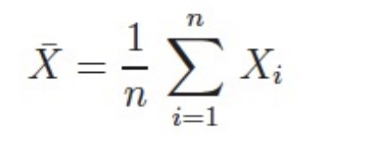
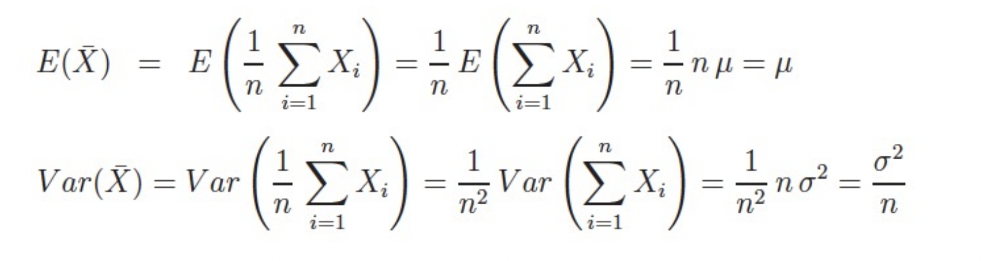

# The sample function
##### Point and interval estimators
* **Point Estimator:** To estimate an individual value of θ = a
  * Average number of electrical appliances running in a European household?
  * Standard deviation of the daily electricity consumption of a household?

* **Interval estimator:** To estimate a range or interval θ = [b, c]
  * Range of NOx-emissions of a Volkswagen diesel representing 90% of the trips?
  Minimum and maximum battery capacity that captures 80% of the batteries?
  * Capacity that at least 90% of the batteries achieve?
  * Confidence interval around a mean (e.g., IQ, life expectancy, daily electricity
  consumption) that contains 90% of the observations?

###### Sampling
* A sample is biased if it does not represent the population.
* The population is the entire set of individuals, objects, or properties and a sample
  is a subset of these individuals, objects, or properties.
  * Populations: All students in your master program, all households in Europe, etc.
  * Samples: 12 students in said faculties, 100 European households, etc.
* Besides estimating a parameter, In interferential statistics, the goals may also be to
  test if a parameter belongs to a population.

> Exam Question: Given an example of a biased sample
>> If a study asks for the average temperature of a household, and we take the temperature of only
student dorms.

> Exam Question: Given an example of a biased sample
>> Taking a sample and determining its mean value is considered a random process due to the inherent
variability and uncertainty involved in selecting a subset of data from a larger population.

###### The sample function: Expected value and variance
* Be x1, …, xn the sample from a population.
* Assume that x1, …, xn are the realizations of independent random variables X1, …, Xn.
* Further, be E(Xi) = µ and Var(Xi) = σ2.
* Further, be Xbar the distribution  
    
* Then the following equations hold:  
  

> * The expected value of the sample function Xbar is the expected value of the population.
> * The variance of the sample function Xbar is the variance of the population divided by n.

> Exam Question: Go back to slide 9. E(X_bar) helps you to estimate the mean of the population. 
 Var(X_bar), however, does not produce an estimate of the variance of the population. What value 
 does it produce?
>> Answer: It produces the variance of the estimated mean

> Exam Question: Go back to slide 9. E(X_bar) helps you to estimate the mean of the population.
Var(X_bar), however, does not produce an estimate of the variance of the population. What value
does it produce?
>> Answer: Multipliers that are moved are squared, see Section 2 for details. The sum, in this case 
(see definition above) is a sum of independent variables. So n is not a multiplier but produces a 
sum that consists of n independent terms.
