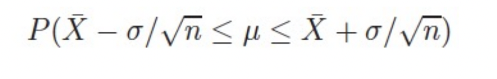
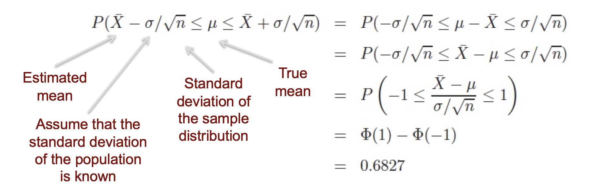
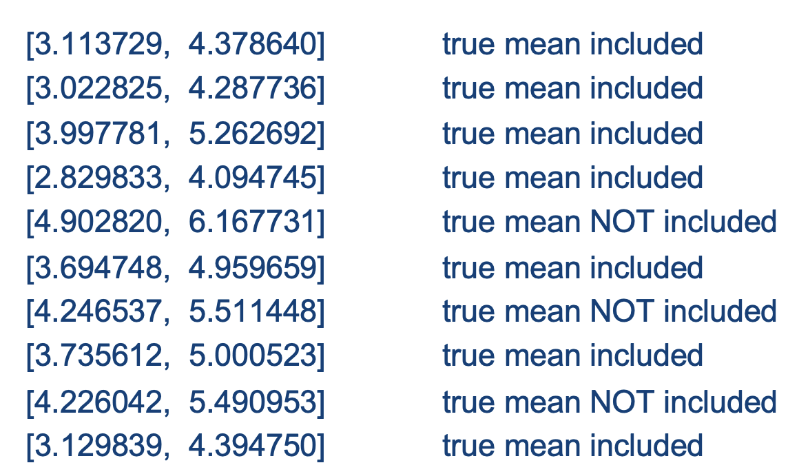
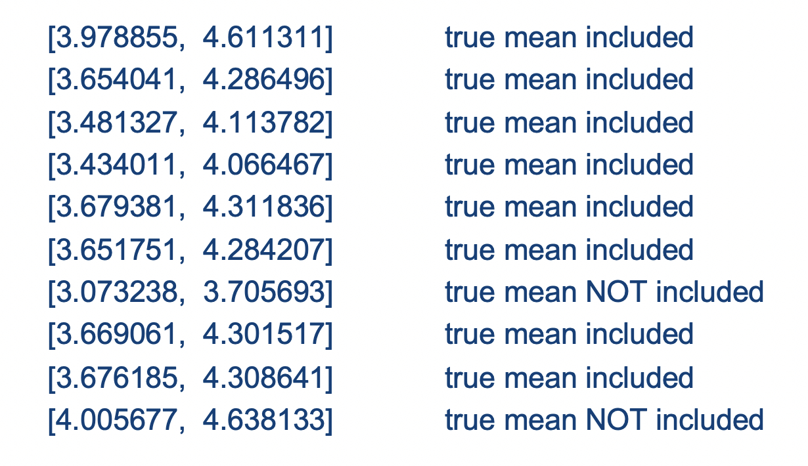
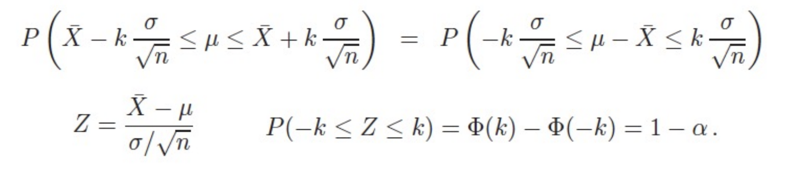
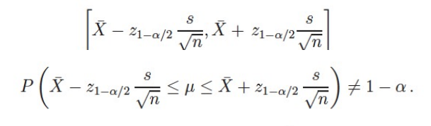

# Confidence Interval
Let us assume that Xi are normally distributed with the μ and σ2.
* What is the confidence level of µ (the actual mean of the distribution) being within a
specific interval around the estimated mean (Here: one standard deviation around
the estimated mean)?
* As shown before, the standard deviation of the sample distribution is
σ(X_bar) = σ/√n. Therefore, the probability is: <br>
 <br>
 <br>

##### Exercise: 1
1. Draw a sample of 10 random numbers from a normal distribution N(4,22).
2. Calculate the interval around your estimate of µ that include µ with a confidence level
   of 68.27%.
3. Repeat step 1.-2. ten times. For your realization of the experiment, how many times
   is the estimate for µ in the interval?
``` R
n = 10
x1 = rnorm(n, mean = 4, sd = 2)
Interval_1 = c(mean(x1) - 2/sqrt(n), mean(x1) + 2/sqrt(n))
```
When one runs the code for 10 times, the following results can be found: <br>
 <br>
> 7 out of 10 intervals include the true mean (if you
executed the experiment, it could be a different number
as it is a random process)

4. Repeat step 1.-3. for a sample size of 40 random numbers. What happens?
   1. Should the number of cases with the true value being within your interval
      systematically increase, decrease, or stay about the same?
   2. What happens to the interval?

``` R
n = 40
x1 = rnorm(n, mean = 4, sd = 2)
Interval_1 = c(mean(x1) - 2/sqrt(n), mean(x1) + 2/sqrt(n))
```
 <br>

> Result: 8 out of 10 intervals include the true mean (if you executed the experiment, it could be a different
number as it is a random process). No, the number does not systematically deviate from the n=10 case.
But the interval is smaller! The larger n made our estimate more precise.

5. Now increase the size of the interval. What happens?
``` R
n = 40
x1 = rnorm(n, mean = 4, sd = 2)
Interval_1 = c(mean(x1) - (2*2/sqrt(n)), mean(x1) + (2*2/sqrt(n)))
```
> Result: The probability that the true mean lies within the interval became higher. We
accepted a larger interval in exchange for a higher confidence level.

##### Confidence Intervals
* We have to live with an estimate, but we want to know how certain we can be that
the true value lies within a given (or derived) interval.
* Thus, a measure for the precision of T is of interest.
* We want: An interval around T [T - a, T + a] and the according confidence level
P(T - a ≤ θ ≤ T + a).
* This interval is called the confidence interval.

##### More on confidence intervals
* The probability that an estimated value of a parameter θ is within the interval
[T - kσT, T + kσT] can be altered by changing the multiplier k.
* k can be chosen such that confidence level is 1-α

 <br>

##### Frequently used confidence intervals
* Intervals with ± 1σ around the mean contain 68.27% of all measured values.
* Intervals with ± 2σ around the mean contain 96.45% of all measured values.
* Intervals with ± 3σ around the mean contain 99.73% of all measured values.

##### Confidence intervals if the variance is not known
* In practical settings, often both mean and variance of a distribution are not known, an the
  standard deviation σ has to be estimated, too.
* For small samples, the confidence level of a confidence interval cannot be calculated as
  before:
   <br>
* The problem here is that the random variable t is not standard normal distribution
* Instead, it follows a student t-distribution with a degree of freedom of df = n-1.
* Thus, use the t-table instead.
* If df > 30, you can assume a normal distribution.

##### Task: Derive a confidence interval
The following data is a sample taken from 64 households.
It describes the water consumption per shower in liter.
1. What is the interval that contains the true shower
   consumption with a certainty of 95%?
   Solve the problem using R.
2. For shower consumption, the variance is not known.
   Is this a problem?

``` R
data <- c(50, 45, 55, 54, 45, 54, 53, 40, 42, 24, 34, 44, 34, 56, 53, 66, 34, 34, 44, 
          44, 56, 56, 45, 54, 45, 66, 33, 54, 33, 27, 25, 39, 39, 41, 50, 45, 55, 54, 
          45, 54, 53, 40, 42, 24, 34, 
          44, 34, 56, 53, 33, 34, 34, 44, 44, 56, 56, 45, 54, 45, 66, 66, 54, 83, 27)

confidence_interval <- t.test(data)$conf.int
print(confidence_interval)
```