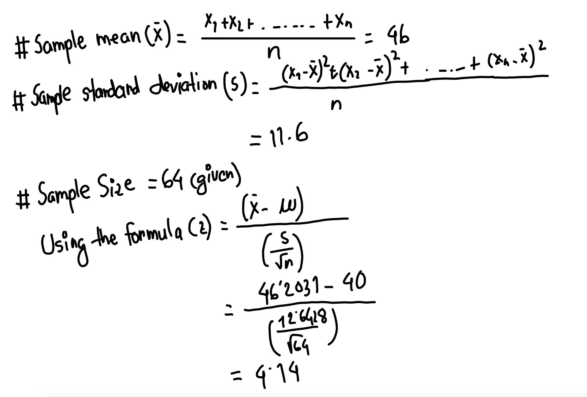

# The testing process
**Preparation:**
* Formulate the hypotheses H0 and H1
* Define the desired significance level alpha
* Check if you have to reject the null hypnosis as follows:

> **Step 1:** Compute from the observations the value tobs of the test statistics T.  
**Step 2:** Compute the p-value. The p-value is the probability of observing a test
statistic for the null hypothesis that is at least as “extreme” as the one
observed.  
**Step 3:** If (and only if) the p-value is less than the significance level, reject the nullhypothesis H0 in favor of H1. 

##### Test statistics: Student's t-test: When to use it?
**A one-sample test** tests if the mean of a population has a value specified in a null hypothesis.
  * For example: If a chocolate manufacturer says the average weight of any chocolate bar that we produce
    is 50g. So we bought a couple of chocolate bars from that company and analyzed the mean. It came out as
    48g. Now wer perform the one-sample test to find out whether the mean is significantly differed from the
    claim or not.
**A two-sample test** tests the null hypothesis that the means of two populations are equal. In other words,
  we try to compare the mean of two independent groups.
  * For example: We want to measure the pain relief of two durgs. We give two independent groups two drugs
  and compare the mean of their pain level.

* Strictly speaking that name (t-test) should only be used if the variances of the two
populations are also assumed to be equal; when this assumption is dropped, the test
is sometimes called Welch's t-test.

Four cases are common exist:
* distribution known and variance known
* distribution known and variance unknown
* distribution unknown and variance known
* distribution unknown and variance unknown

##### Case 1: Known distribution and known variance
  

##### Case 2: Known distribution and unknown variance
  

##### Z-Table
  

##### Example for a one-sided t-test.
An online source reports that the water consumption per shower is 40 liters. A researcher
believes that the average water consumption µ per shower is above 40 l.
She wants to test this assumption based on a data set containing 64 samples. 
**Hints: This one is for the second** 

**Answer:** 
**1. Formulate Hypotheses:**
**Null Hypothesis (H₀):**  
μ=40 liters (the average water consumption per shower is 40 liters). 
**Alternative Hypothesis (H₁):**  
μ>40 liters (the average water consumption per shower is above 40 liters).  

**2. Significance level:**  
Chosen significance level (α) = 0.05. or 5%  

**3. Calculate Test Statistics:**  
  

**4. Make decision:**  
Compare the calculated z-value with the critical z-value:  
* If z>1.645, reject the null hypothesis.
* If z≤1.645, fail to reject the null hypothesis.

Since -> z>z(1-a) which meets the first condition, we reject the null hypothesis.  

##### Case 3 & 4: Unknown distribution.
  

##### t-test to compare two dependend samples
  

##### Table for Student-t-test
  

##### Example for a t-test to compare two dependend samples
* Before intervention (223 259 248 220 287 191 229 270 245 201)
* After intervention (220 244 243 211 299 170 210 276 252 189)
* Difference (3 15 5 9 -12 21 19 -6 -7 12)

  

**Type 1 Error (False Positive):** 
Definition: This error occurs when a null hypothesis that is actually true is incorrectly rejected. 
Explanation: Imagine you conduct a hypothesis test and conclude that there is a significant effect or 
difference when, in reality, there is none. It's essentially a "false alarm" or an incorrect positive finding. 
**In other words** when you should not have rejected H1, but you did.

**Type 2 Error (False Negative):** 
Definition: This error occurs when a null hypothesis that is actually false is not rejected.  
Explanation: In this case, you fail to detect a real effect or difference that exists. It's like missing an 
important finding, and it is often associated with not having enough power in a statistical test. 
**In other words** when you should have rejected H0, but you did.

**Exam Questions:** 
* What is a Type I error?
> Rejecting the null hypothesis when you should not.

* What is a false positive?
> A type 1 error.

* Assume you perform a test and chose to make a statement with a level of confidence 95%. 
How big is the probability of a Type I error?
> 5%.

* Assume you perform a test and chose to make a statement with a level of confidence of 95%. 
Can you say something about the likelihood of a Type II error?
> Correct:No, this is not possible without knowing the characteristics of the overall population.

* Assume you flip a fair coin ten times, and it produces 10 times a head. The null hypothesis is that it is a fair coin. 
If you choose alpha to be 1%, what your conclusion would be, and what error would you make?
> P for ten times head = 0.5^10 = 0.0009765625 = 0.09765625%. This is much less likely than 1%. You would reject H0 even 
if you should not and thus make a Type I error.