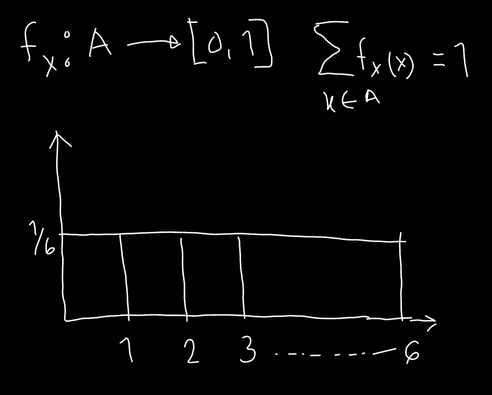
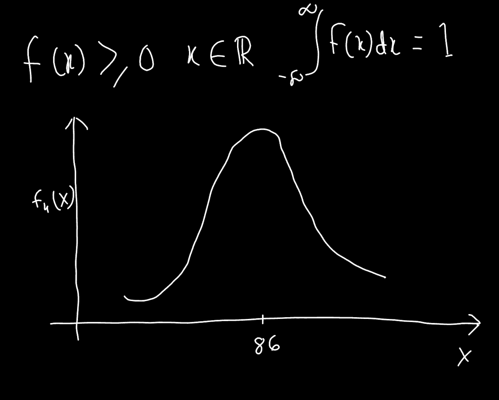
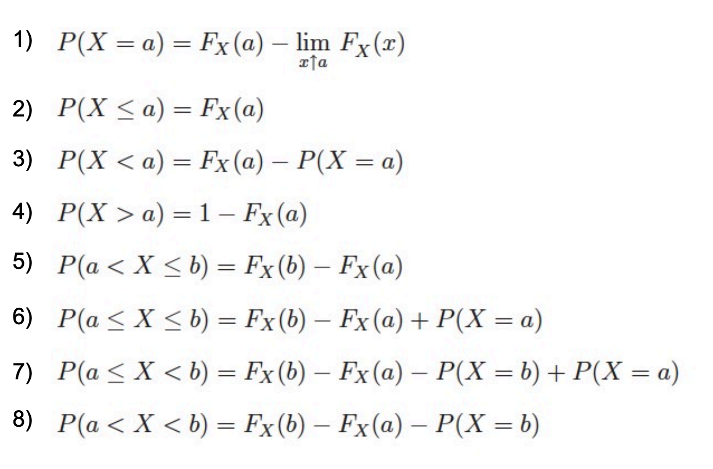

# Random Variables and Distribution Functions
### Part-1
##### Random variables

* A **random variable** is a variable whose value is subject to variations
due to chance.

* It can take on a **set of possible different values;** each value occurs
with an **associated probability.**

* Ω -> Set of possible outcomes, e.g., {heads, tails}
* ω -> Outcome of a random event, e.g: outcome of flipping a coin ()
> The upper case omega (Ω) represents set of all possible outcomes and the
lower case omega (ω) represents the outcome of the event. For example: Flipping
a coin has 2 possible outcomes {heads and tails} but after flipping the coin
there could be one result {head or tail}
* X -> Random variable, e,g: money paid out, number of heads after tossing
a coin several times.
> Here X represents what happens after a random event occurs. For example,
if head was my choice, head it is, I get 50 Euro otherwise I loose 50 Euros.
* X(ω) -> Function values

* A **random variable X** can be seen as a function from a set of possible
**outcomes Ω** to a **set E:** **X:Ω → E**

##### Discrete and continuous random variables
* When the image of a random variable X is finite or countably infinite, it
is called **discrete** random variable.
    * It's distribution can be described by a **probability mass function.**
        
* When the image of a random variable X is uncountably infinite, it is called
**continuous** random variable.
    * It's distribution can be described by a **probability density function.**
      
* Sometimes, both the probability mass and the probability density function are simply
  called probability function

##### Probability mass function: Example 1
A coin is flipped once. Player A receives 1 EUR if the result is “heads”.
* Describe the random variable Y and the probability mass function f(Y).
```
Y(ω) =  {1EUR, if ω = heads}<br>
        {0EUR, if ω = heads}

f(Y) =  {1/2, if Y = 1}
        {1/2, if Y = 0}
```

##### Probability mass function: Example 2
A coin is flipped twice. Player A receives 1 EUR for each time the result is “heads” .
Describe the random variable Z and the probability mass function f(Z).
```
Y(ω) =  {2Eur, if ω = (heads, heads)}
        {1Eur, if ω = (tails, heads)}
        {1Eur, if ω = (heads, tails)}
        {0Eur, if w = (heads, tails)}

f(Y) =  {1/4, if Y = 2}
        {1/2, if Y = 1}
        {1/4, if Y = 0}
        {0, otherwise}
```

##### Cumulative distribution function of X
* X being a discrete random variable. The expression to the right is termed
cumulative distribution function (CDF) of X.
Properties of the CDF:
* FX(x) is monotonically increasing
* FX(x) = 0 for x approaching -infinity
* FX(x) = 1 for x approaching +infinity


##### Calculation rules for cumulative distribution functions FX


The probability density function(PDF) of a uniform distribution between a and b is
given by:<br>
F(x) = 1/b-a, (a = lower bound, b = upper bound)<br>
In this case the F(x) = 1/(10-2) = 1/8 = 0.125

The cumulative distribution function (CDF) of a Uniform distribution between a and b
is a step function that increases linearly from 0 to 1 over the interval [a,b]. The
formula for CDF F(x) is given by: <br>
F(x) = (x-a)/(b-a)

The function f(x) is given as follows:
f(x) is 0.2 for -2.5 <= x <= 2.5 and 0 otherwise

1. Is it a density function?
To determine whether the given function f(x) is a probability density function(PDF),
we need to check two conditions:

1. The function must be non-negative for all values of x:f(x) >= 0 for all x
2. The total area under the curve of the function must be equal to 1

Let's evaluate these condition for the given function:
```
f(x) =  {0.2 for -2.5< x < 2.5}
        {0 for otherwise}
```
1. **Non-negativity**: f(x) is defined as 0.2 for the interval -2.5 <= x <= 2.5, and
0 elsewhere. Since 0.2 is a positive constant, f(x) is non-negative for all x.
2. **The total area under the curve**: The function is non-zero only in the interval
-2.5<= x <= 2.5, and it's value is constant (0.2) over the interval. The interval's
width is 2.5-(-2.5) = 5. Therefore, the total area under the curve is 0.2 * 5 = 1.
<br>

So, the given function f(x) satisfies both conditions and is indeed a probability
density function.