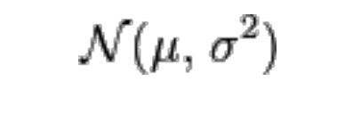

# Special Distribution Function

##### The discrete uniform distribution
* Uniform distribution P(X=x)=1/N for x = 1,2,…,N
* Example: throw a dice, sample one number from lottery 1 out of 49, etc.
* Expected value and variance of the uniform distribution:
```
E(X) = (N+1)/2
Var(X) = (Nˆ2 - 1)/12
```
* Proof that Var(x) holds?
```
Var(X) = E(Xˆ2) - E(X)ˆ2
```

##### The continuous uniform distribution
* A random variable is uniformly distributed if its density function is defined by
```
fx(x) = {1/(b-a) for a <= x <= b}
        {0 otherwise} 
```

* Its distribution function is given by
```
fx(x) = {0            for x < a}
        {(x-a)/(b-a)  for a <= x <= b}
        {1            for x > b} 
```

* Expected value
```
E(x) = (a+b)/2
Var(x) = ((a-b)ˆ2)/12
```

##### The binomial distribution
* The binomial distribution has the parameters n and p.
* Used to determine the number of successes in a sequence of n independent
  experiments, with each experiment having the probability of p producing the outcome
  success/yes/one/true and q=(1-p) producing failure/no/zero/false:
* The probability mass function is: <br>
  
* The mean is µ = n*p
* The variance is var = n*p*(1-p)
* Example question: 10% of the households quality for an energy-saving program.
  There is space for 200 households in the program. What is the probably that one has
  to turn away interested households when asking 1800 households to participate?
    * Careful: Draws must be independent (if not: hypergeometric distribution)!
    * But With N >> n, the binomial distribution is a good approximation even when
      drawing without a replacement.

##### The normal distribution
* Continuous probability distribution
  with the probability density function: <br>
 
* μ = mean (also median and mode);
* σ is the standard deviation
* the variance is therefore σ2;
* Notation: <br>
  
* A picture of normal distribution is: <br>
  
* The cumulative distribution function
  <CDF> of the Normal Distribution is: <br>
 
* In other words: F(x) is the probability that a
  normally distributed random variable X
  with E(X)=μ and V(X)=σˆ2 is smaller or
  equal than x
* A picture of density function is: <br>
  

##### The standard normal distribution
* If X is a normally distributed with the parameters μ and σ2, then Z is a
  standard normal distribution if: <br>
```
Z = (X-μ)/σ
```
* Z has the density function ϕ(z) and the distribution function Φ(z) <br>
  
* X is a normally distributed with the parameters μ and σ2. Probabilities
  can be found as follows: <br>
  
* Only positive values of z need to be in
  a table since the following relation holds:: <br>
  

##### Q-Table


##### Properties of the cumulative distribution function (CDF) of the standard normal distribution
Some trivial (but important) results from the area under bell curve: <br>


###### Sample Problem 1
Assume that households have a mean electricity consumption of 3500 kWh per year and a standard
deviation of 3000 kWh. What is the probably that a household consumes
less than 1500 kWh? <br>


###### Sample Problem 2
Efficiency gains in a campaign: Savings normally distributed with μ= 50 kWh and variance σ2 = 25 kWh2
What is the probability that a household saved no more than 55 kWh? <br>
