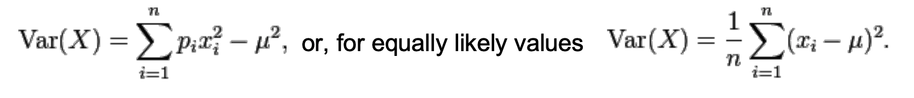

# Summary Statistics
#### The expected value and variance
* Probability distributions can be described by a number of characteristic measures.
Especially important are the 
    * expected value E(X) and the
    * variance Var(X)

* The expected value(=the arithmetic mean) specifies the "position of the center" of
the distribution.
* The variance specifies the "width" of the distribution.

#### The expected value
* For a discrete random variable with the probability function fx(X), E(X) is <br>
E(x) = ∑ xfx(x), for all values x, where xfx is defined.
* For a continuous random variable with density function fx(x), E(x) is <br>

* The expected value is also named expectation (value), (arithmetic) mean, and first
  (statistical) moment, and symbolized by µ
* Sometimes, the symbol ø is used to represent the arithmetic mean
* For a data set containing the n elements x1, …, xn, the expected value is <br>
  
* • For a univariate (=function of exactly one variable) discrete random variable X (finite
  case) where the elements xi occur with probability pi 
  , the expected value is <br>
  

#### Computational rules for expected values
* Be X and Y random variables and a, b, and c constants.
* The expected number of constant is the constant: E(c) = c
* The expected value operator is linear:
```
  E(X + c) = E(X) + c
  E(X + Y) = E(X) + E(Y)
  E(a * X) = a * E(X)
```

* Consequently, E(a*X + b*Y +c) = a * E(X) + b * E(Y) + c

#### The variance and standard deviation
* Be X a random variable. The variance Var(X) or σ2 of X is defined as <br>

* For the discrete and the continuous case, the variance is calculated as follows <br>

* For the variance, the following expression holds <br>

> Exam questions would be like:
```
Show that Var(x) = E[X^2] - (E[X])^2.
```
* For the discrete random variable X with expected value µ, the variance is <br>

* For a continuous random variable X with expected value µ, the variance is <br>


#### The variance(cont'd) and standard deviation
* Linear transformation: Var(aX+b) = aˆ2ˆVar(X)
* The standard deviation σ is the square root of the variance
* Thus, the units of the expected value and the standard deviation are identical
* Be careful when calculating the variance of the sum of two random processes. If the
random variables are not independent of each other, there is a common variability
expressed in the covariance (Cov).<br>

* If the random variables are independent of each other, Cov is zero: <br>

* Exam questions would be like:
```
X and Y being random variables, a and b constants. Under what condition does the following equation hold?
Var(aX + bY) = a^2 * Var(X) + b^2 * Var(Y)
```
* Thus, for the independent case, the standard deviation of the sum of two
  independent random processes is the square root of the sum of squares.
* The standard deviation of a set of rational numbers is always zero or positive.

#### The median
* The median is the number that separates the lower and the higher half of a sample
or probability distribution. Example: The median of {1, 2, 3, 4, 10} is 3
* If the number o a finite list of elements is even, the median is usually defined as the
mean of the two “middle” values. Example: The median of {1, 2, 3, 4, 5, 50} is 3.5
* The median is the same as the second quartile (introduced later)
* The median is a “robust” value as it is not prone to outliers
  * It is, in fact, the most resistant statistic, allowing half the data to be outliers
* For absolutely continues probability distributions, the median satisfies: <br>
   

