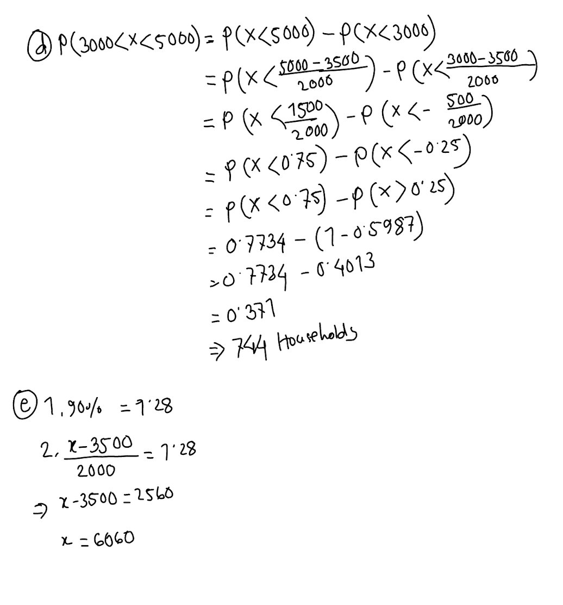

### Random variables and probability functions
1. An energy consultant tries to convince home owners to renovate the roof of their
   houses to achieve a better thermal insulation. She manages to complete 3
   consulting talks per timeslot. The probability that each home owner actually opts for
   the home improvement is 10%.  
    a. Describe the random variable “Does home improvement” D  
    b. Write down the probability mass function.  
    
**Answer:** D is the number of home owners that opts for the home improvement, after the consultation
during the time slot.  

### Parameters of distributions
1. Calculate mean, median, variance, and Standard Deviation of the following samples:  
a. a = {1,1,1,1}; Answer: mean=1, median=1, variance=0, sd=0  
b. b = {3,7,8,9,13}; mean=8, median=8, variance=52/5=10.4, sd=3.22  
c. c = 3*b +1 = {10, 22, 25, 28, 40}; mean=25, median=25, variance=93.6, sd=9.67  
  
2. Calculate the expected value and variance for the following:  
     
3. Given is f(x) with f(x) = 0.5x – 0.5 for 1≤x≤3 and f(x) = 0 elsewhere.
   1. Show that f(x) is a density function
   2. Derive the cumulative distribution function of f(x)
   3. Determine the median and the expected value
   4. What is the probability for X>1?  
     
     

4. The annual electricity consumption of two-person households of a given neighborhood
   follows (approximately) a normal distribution with µ=3500 kWh and σ=2000 kWh. 4000
   persons live in the neighborhood under study.
   1. How many households consume over 3500 kWh?
   2. How many households consume less than 2000 kWh?
   3. How many households consume more than 3000 kWh?
   4. How many households consume between 3000 kWh and 5000 kWh?
   5. What is the annual consumption that qualifies a household to be among the
   top 10% of the highest consuming households?
   6. What is the annual consumption that qualifies a household to be among the
   top 5% of the lowest consuming households?
  
  
  
