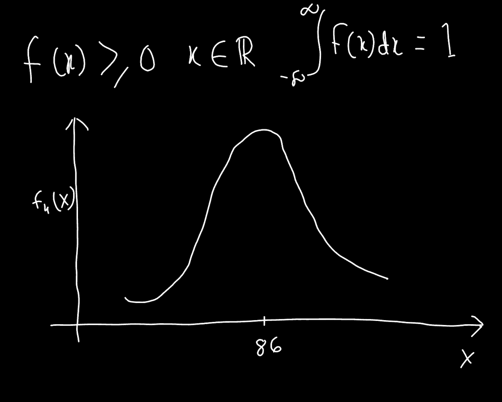

# Random Variables and Distribution Functions
### Part-1
##### Random variables

* A **random variable** is a variable whose value is subject to variations
due to chance.

* It can take on a **set of possible different values;** each value occurs
with an **associated probability.**

* Ω -> Set of possible outcomes, e.g., {heads, tails}
* ω -> Outcome of a random event, e.g: outcome of flipping a coin ()
> The upper case omega (Ω) represents set of all possible outcomes and the
lower case omega (ω) represents the outcome of the event. For example: Flipping
a coin has 2 possible outcomes {heads and tails} but after flipping the coin
there could be one result {head or tail}
* X -> Random variable, e,g: money paid out, number of heads after tossing
a coin several times.
> Here X represents what happens after a random event occurs. For example,
if head was my choice, head it is, I get 50 Euro otherwise I loose 50 Euros.
* X(ω) -> Function values

* A **random variable X** can be seen as a function from a set of possible
**outcomes Ω** to a **set E:** **X:Ω → E**

##### Discrete and continuous random variables
* When the image of a random variable X is finite or countably infinite, it
is called **discrete** random variable.
    * It's distribution can be described by a **probability mass function.**
        
* When the image of a random variable X is uncountably infinite, it is called
**continuous** random variable.
    * It's distribution can be described by a **probability density function.**
      
* Sometimes, both the probability mass and the probability density function are simply
  called probability function

##### Probability mass function: Example 1
A coin is flipped once. Player A receives 1 EUR if the result is “heads”.
* Describe the random variable Y and the probability mass function f(Y).

Y(ω) =  {1EUR, if ω = heads}
        {0EUR, if ω = heads}

f(Y) =  {1/2, if Y = 1}
        {1/2, if Y = 0}

##### Probability mass function: Example 2
A coin is flipped twice. Player A receives 1 EUR for each time the result is “heads” .
Describe the random variable Z and the probability mass function f(Z).
Y(ω) =  {2Eur, if ω = (heads, heads)}
        {1Eur, if ω = (tails, heads)}
        {1Eur, if ω = (heads, tails)}
        {0Eur, if w = (heads, tails)}

f(Y) =  {1/4, if Y = 2}
        {1/2, if Y = 1}
        {1/4, if Y = 0}
        {0, otherwise}